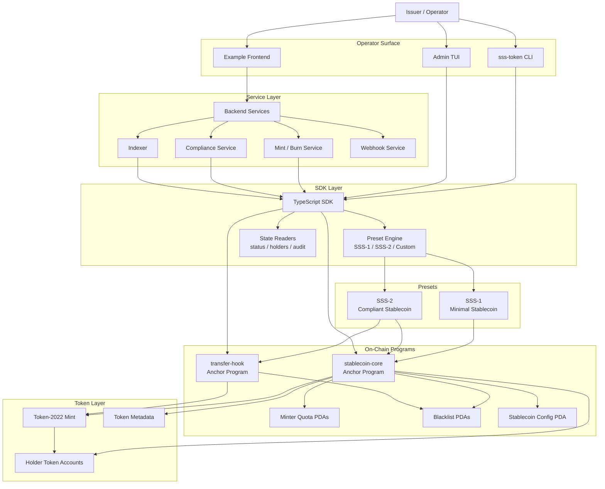

# Architecture

## System Diagram

## Flow Summary

- Operators interact through the CLI, the admin TUI, or the example frontend.
- The frontend talks to the backend services, while the CLI and TUI call the TypeScript SDK directly.
- The SDK resolves presets, builds transactions, reads chain state, and routes SSS-2 compliance paths to the transfer-hook program when enabled.
- `stablecoin-core` owns config, roles, quotas, blacklist state, pause controls, and Token-2022 CPI actions.
- `transfer-hook` enforces blacklist checks on user transfers while still allowing compliant seizure paths.
- Backend services persist operational requests, failures, and outbox events for operator workflows.

## Layer 1 — Base SDK

- Stablecoin configuration model (name, symbol, decimals, authorities)
- Preset + custom config merge strategy
- Core operations: mint, burn, transfer, freeze/thaw, pause/unpause
- Supply tracking and per-address balances
- Minter quota tracking

## Layer 1B — On-Chain Core

- `programs/stablecoin-core` Anchor program
- PDA-backed stablecoin config account keyed by mint
- Role-separated authorities for master, mint admin, burner, pauser, freezer, blacklister, and seizer
- PDA-backed minter quota accounts and blacklist accounts
- Dedicated authority transfer and minter update flows in the control plane
- Token-2022 CPI paths for mint, burn, freeze/thaw, and seize

## Layer 2 — Modules

- Compliance module (blacklist add/remove, seize)
- Module access is feature-gated by preset/extension flags
- Transfer path checks blacklist state when compliance is enabled
- `programs/transfer-hook` now exists as the first enforcement scaffold for SSS-2

## Layer 3 — Standards

- SSS-1: minimal stablecoin profile
- SSS-2: compliance profile with transfer-hook/permanent-delegate assumptions

## Security Model

- Role-separated operations expected (`master`, `minter`, `burner`, `pauser`)
- SSS-2 extends with `blacklister` and `seizer`
- Compliance paths fail fast when not enabled
- Pause, freeze, and blacklist checks short-circuit state changes

## Current Execution Model

This repo is currently in a hybrid phase:

- The local simulator still exists for fast operator workflow iteration.
- The repo now also ships a real on-chain client and CLI path backed by Anchor programs and Token-2022.
- The Anchor workspace provides the current on-chain control plane for config, quotas, compliance flags, mint/burn/freeze operations, and blacklist management.
- The transfer-hook layer now enforces blacklist checks for normal transfers while still allowing compliance seizure through the stablecoin config PDA.
